# Arbeitsbericht

- Name: Mate Szvercseg 
- Datum: 26.05.2026
- Thema: Aufgaben zu regular expression, Theorie + Übung
- Fach: SYTB
- Klasse: 3AHITS


## Übersicht
- [zur Aufgabenstellung](https://www.franzmatejka.at/htl/doc/SYTB_3/20_regex_ue.html)

## Theorie

zwei moglichkeiten 

- grep 
- sed


## grep
```bash
┌──(kali㉿kali)-[~/20262605]
└─$ grep 'Werkstatt' klassenkassa.csv
```

gibt alle zeilen aus die das Wort <mark>"Werkstatt"</mark> enthalten 


<mark></mark>

```bash 
┌──(kali㉿kali)-[~/20262605]
└─$ grep 'W.*' klassenkassa.csv
```
gibt alle zeilen die ein Wort der mit "W" und gefolgt von beliebiger zeichen wird aus 

```bash 
┌──(kali㉿kali)-[~/20262605]
└─$ grep 'W.' klassenkassa.csv 
```
gibt alle zeilen aus die ein Wort enthalten der mit "W" anfängt
```bash 
┌──(kali㉿kali)-[~/20262605]
└─$ grep '1[0-9]\.' klassenkassa.csv 
```
wird alles ausgegeben der wo zum begin ein 1 steht gefolgt von eine zahl zwischen 0 bis 9 und am ende ein punkt ist 
```bash 
┌──(kali㉿kali)-[~/20262605]
└─$ grep -o  '1[0-9]\.' klassenkassa.csv
```
nur matches werden ausgegeben
```bash 
┌──(kali㉿kali)-[~/20262605]
└─$ grep '1[0-9]\.[0-9][0-9]\.' klassenkassa.csv
```
selbe prinzip wie bei vorletzen bsp nur hier werden zwei abteilungen gematch zum Beispiel: <mark>18.10.</mark>2026
## Sed 
```bash 
┌──(kali㉿kali)-[~/20262605]
└─$ echo '1234ccbbaa1234' | sed 's/ccbbaa/XYZ/'
1234XYZ1234
```
's/ccbbaa/XYZ/' substituiert ccbbaa mit XYZ
```bash 
┌──(kali㉿kali)-[~/20262605]
└─$ echo '1234ccbbaa1234' | sed 's/cc..aa/XYZ/'
1234XYZ1234

┌──(kali㉿kali)-[~/20262605]
└─$ echo '1234ccXXaa1234' | sed 's/cc..aa/XYZ/'
1234XYZ1234

┌──(kali㉿kali)-[~/20262605]
└─$ echo '1234cc1!aa1234' | sed 's/cc..aa/XYZ/'
1234XYZ1234
```
selbes prinzip nur das zwischen cc und aa kann irgendwas stehen
```bash 
┌──(kali㉿kali)-[~/20262605]
└─$ echo '1234cc1!aa1234' | sed 's/[ab]/XYZ/'  #erstes a nachdem rufzeichen 
1234cc1!XYZa1234

┌──(kali㉿kali)-[~/20262605]
└─$ echo 'ksdjfoienf' | sed 's/[ab]/XYZ/' #enthält keinen a oder b
ksdjfoiernf

┌──(kali㉿kali)-[~/20262605]
└─$ echo 'ksdjfaiernf' | sed 's/[ab]/XYZ/' # a befindet sich mitten drin
ksdjfXYZiernf
```
[ab] bedeutet das der nur der erste gematchte a oder b substituiert wird
```bash 
┌──(kali㉿kali)-[~/20262605]
└─$ echo 'ksdjaabbbbaaf' | sed -E 's/[ab]+/XYZ/'
ksdjXYZf
```
ed -E ist besonders nützlich, wenn du komplexe Muster schreiben musst, da du weniger Backslashes brauchst und die Lesbarkeit steigt. 

```bash 
┌──(kali㉿kali)-[~/20262605]
└─$ echo 'Version V12.51 / March 2026' | sed 's/V..\.../---/'
Version --- / March 2026

┌──(kali㉿kali)-[~/20262605]
└─$ echo 'Version V12.51 / March 2026' | sed 's/V[0-9]*\.[0-9]*/---/'
Version --- / March 2026
```
Beim ersten version verwendete ich . für beliebiger zeichen und \\. das der trenende punkt auch ersetz wird

Beim zweiten Version verwendete ich 
- s/.../.../ = substitution
- V = sucht den Buchstaben V
- [0-9]* = danach beliebig viele Ziffern
- \. = ein echter Punkt .
- [0-9]* = wieder beliebig viele Ziffern
```bash 
┌──(kali㉿kali)-[~/20262605]
└─$ echo 'Version V12.51 / March 2026' | sed 's/V[0-9]*\.[0-9]*/(&)/'  
Version (V12.51) / March 2026
```
& steht für den gefundenen Text
Der Treffer wird hier in Klammern gesetzt
```bash 
┌──(kali㉿kali)-[~/20262605]
└─$ echo 'lkajhfoiAlkdf' | sed 's/[^a-z]/_/'                          
lkajhfoi_lkdf
```
[^a-z] = alles außer Kleinbuchstaben
erstes passendes Zeichen wird durch _ ersetzt
```bash 
┌──(kali㉿kali)-[~/20262605]
└─$ # line anchor    

┌──(kali㉿kali)-[~/20262605]
└─$ # line anchor ^..beginning, $..end of line 
```

```bash 
┌──(kali㉿kali)-[~/20262605]
└─$ echo 'aodfhoea' | sed 's/^o/_/'         
aodfhoea
```
^ -> Anfang der Zeile
ersetzt nur ein o am Zeilenanfang
```bash 
┌──(kali㉿kali)-[~/20262605]
└─$ echo 'aodfhoea' | sed 's/o/_/' 
a_dfhoea
```
ersetzt das erste vorkommende o irgendwo in der Zeile
```bash 
┌──(kali㉿kali)-[~/20262605]
└─$ echo 'oodfhoea' | sed 's/^oo/_/' 
_dfhoea
```
Zeile muss mit oo beginnen
oo wird durch _ ersetzt
```bash 
┌──(kali㉿kali)-[~/20262605]
└─$ echo 'oodfhoea' | sed 's/oo$/_/'
oodfhoea #kein o am ende


┌──(kali㉿kali)-[~/20262605]
└─$ echo 'oodfhoeao' | sed 's/oo$/_/' 
oodfhoeao #einen o am ende

┌──(kali㉿kali)-[~/20262605]
└─$ echo 'oodfhoeaoo' | sed 's/oo$/_/'
oodfhoea_ #zwei os am ende
```
$ = Ende der Zeile
ersetzt nur oo am Zeilenende

## RegexOne Lessons


### Lesson 1
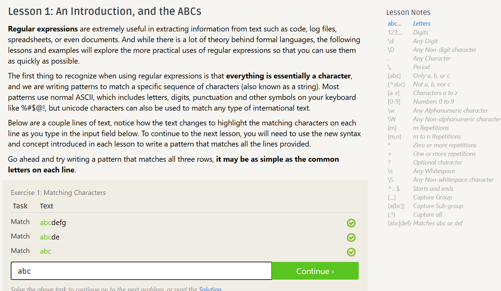
### Lesson 2
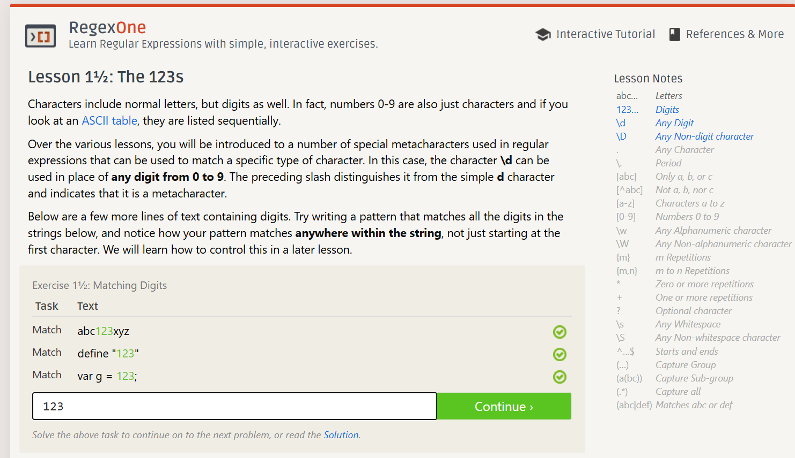
### Lesson 3
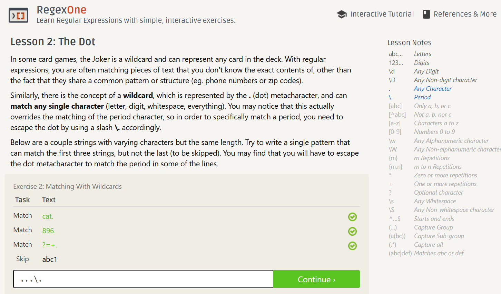

### Lesson 4
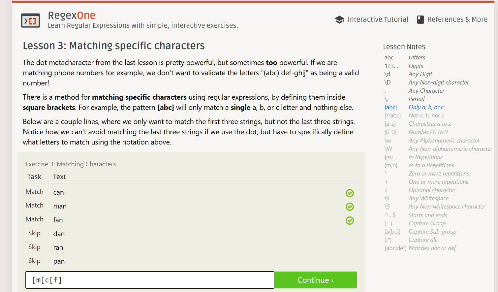

### Lesson 5
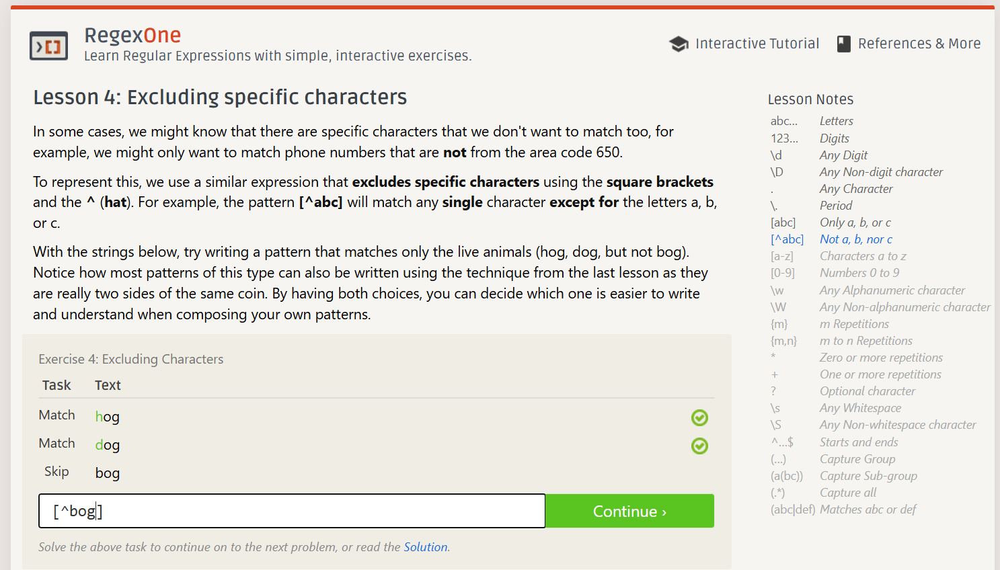

### Lesson 6


### Lesson 7


### Lesson 8
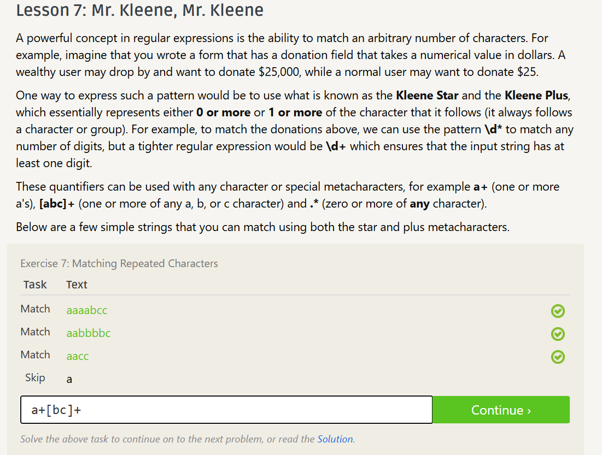

### Lesson 9
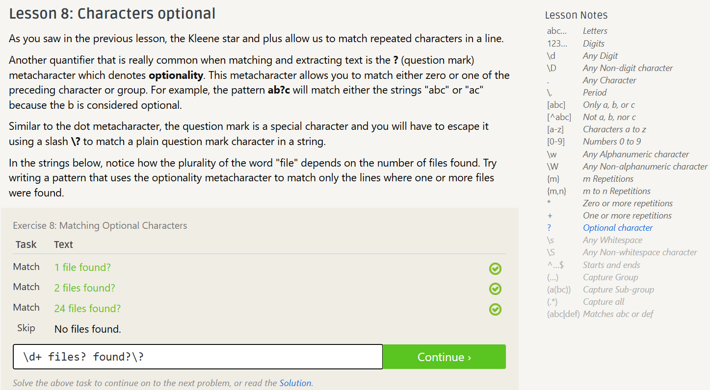

### Lesson 10


### Lesson 11
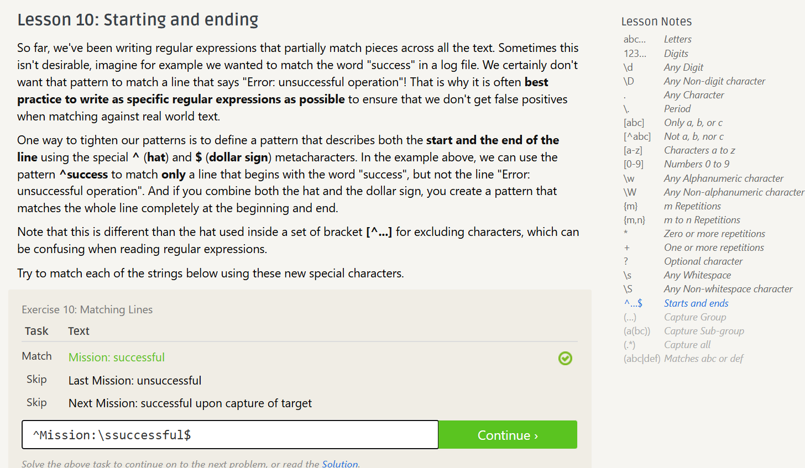

### Lesson 12
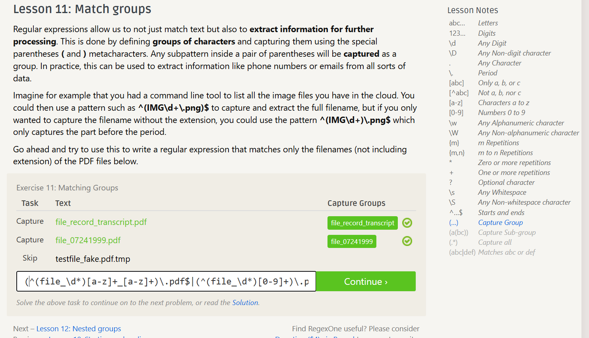

### Lesson 13
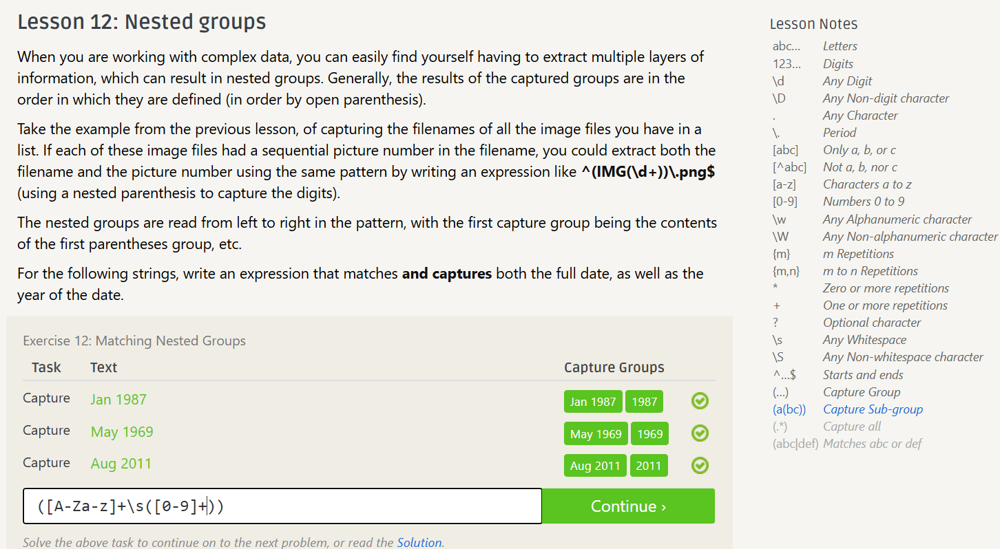

### Lesson 14
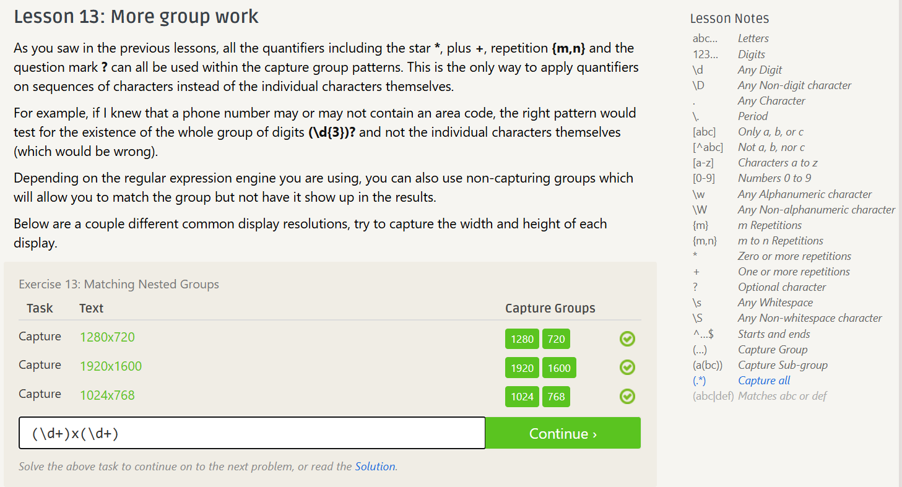

### Lesson 15
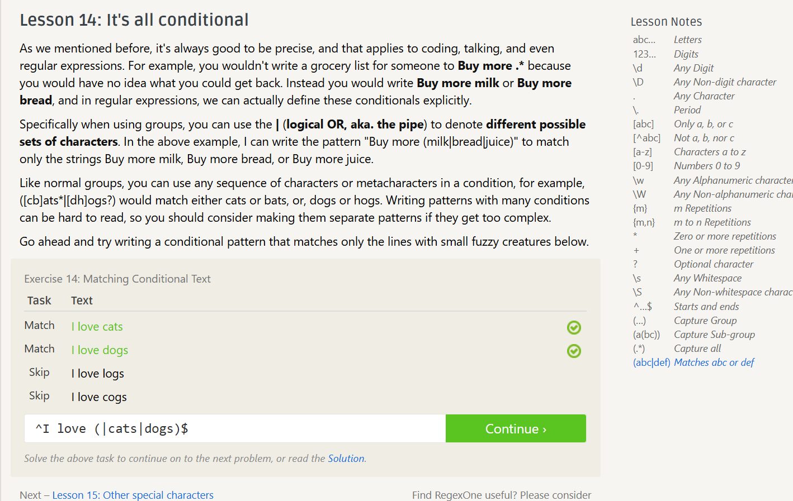

## Übungen

## Übung (Subdir Count)
Skript: 
```bash
#!/bin/bash
ls -l | grep "^d" | wc -l
```

Terminal: 
```bash 
┌──(kali㉿kali)-[~/20260609]
└─$ mkdir unterdir1 
┌──(kali㉿kali)-[~/20260609]
└─$ mkdir unterdir2 
┌──(kali㉿kali)-[~/20260609]
└─$ chmod +x SubdirCount.sh  
┌──(kali㉿kali)-[~/20260609]
└─$ ./SubdirCount.sh
2
```
## Übung (REs)
Skript: 
```bash
#!/bin/bash
 
echo '#abc#' | sed 's/#$/d/'
echo '#abc#' | sed 's/^#/d/'
echo '#abc#' | sed 's/^/===/'
echo '#abc#' | sed 's/a[a-z]*/(&)/'

```

Terminal: 
```bash 
┌──(kali㉿kali)-[~/20260609]
└─$ ./Sed.sh
#abcd
┌──(kali㉿kali)-[~/20260609]
└─$ ./Sed.sh
#abcd
dabc#
┌──(kali㉿kali)-[~/20260609]
└─$ ./Sed.sh
#abcd
dabc#
sed: -e expression #1, char 0: no previous regular expression
┌──(kali㉿kali)-[~/20260609]
└─$ ./Sed.sh
#abcd
dabc#
===#abc#
┌──(kali㉿kali)-[~/20260609]
└─$ ./Sed.sh
#abcd
dabc#
===#abc#
()#abc#
┌──(kali㉿kali)-[~/20260609]
└─$ ./Sed.sh
#abcd
dabc#
===#abc#
(#abc)#
┌──(kali㉿kali)-[~/20260609]
└─$ ./Sed.sh
#abcd
dabc#
===#abc#
#(abc)#
```
## Übung (sed)
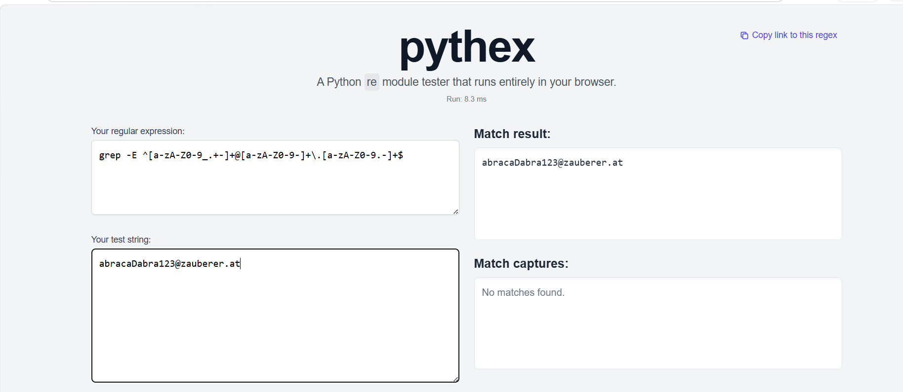

## Nicht erledigt
- Datum 
- Logfile
- Regular Expressions ||
